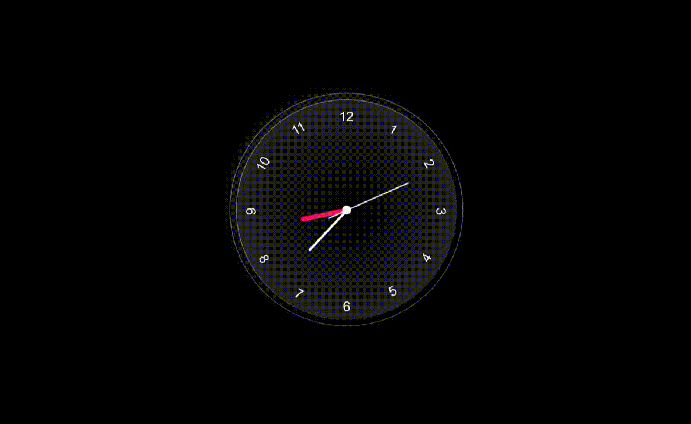
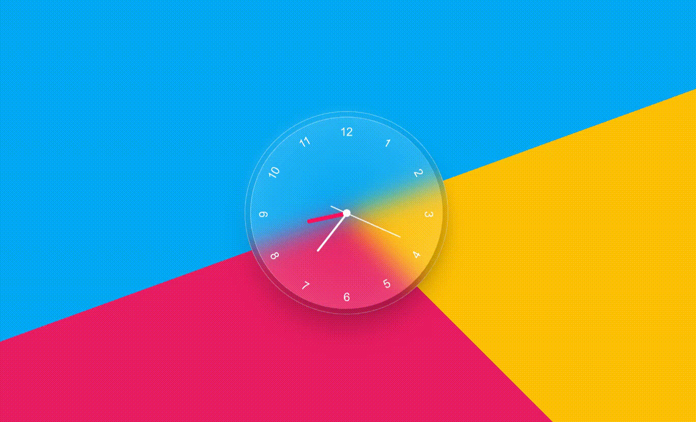
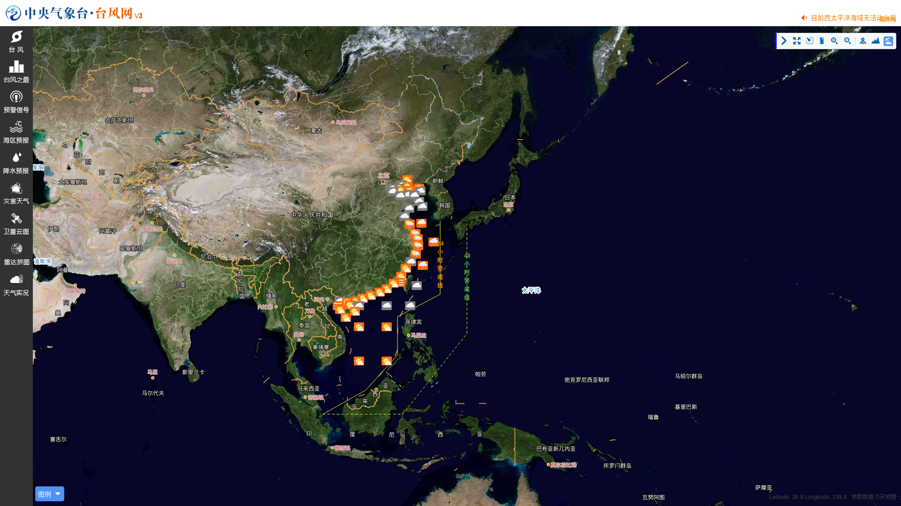

# qt.mimicry-clock-screensaver 

> 适用于深度操作系统的屏保拟态时钟程序 - [基于此屏幕保护程序 - 开发指南](development.md)

## 屏保演示

* 在配置好屏幕保护设置后，执行 `deepin-screensaver` 即可立即预览屏保效果\
    

## 定制说明

此程序可基于更改部分代码而达到不同的效果。

1. 取消注释 `assets/style.css` 的 19 行和 30 行，你将获得一个彩色背景样式图\
    

2. 通过代码部分修改你将得到各种自定义的效果，你或许可以配置在线主页为屏保 (效果图)
    ```c
    // 例如: 可定制成以 '中国台风网' 页面作为屏保
    // view->page()->load(QUrl("http://typhoon.nmc.cn/web.html")); 
    ```
    